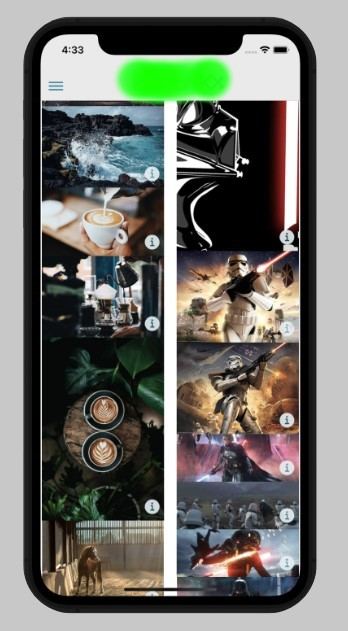
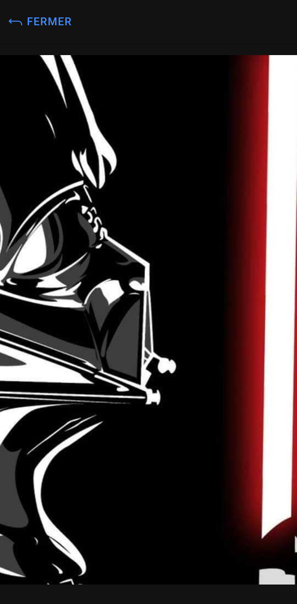
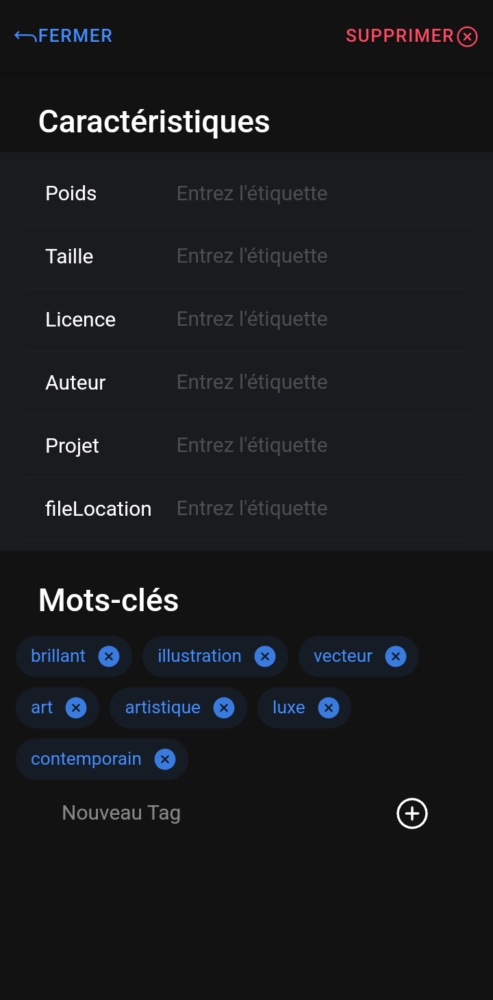
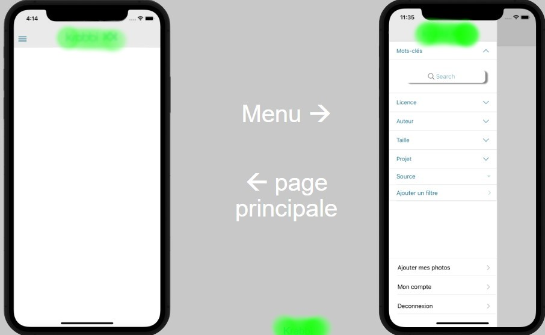

# Krabbi
Le code a été remis au client et est donc pas disponible, les détails d'implémentations ne seront pas fournis.
# Introduction 

Projet Ingénieurie realisé pour un client de l'école. Celui-ci a veut lancer une application mobile permettant de stocker des images dans une gallerie. Lors de l'enregistrement, ces images sont envoyées à un serveur distant où est executé un programme permettant d'associer aux photos des mots clefs.

# Réalisation 

L'application mobile a été réalisée avec  Ionic Angular, TypeScript.

Elle utilise une API développée par le client, permettant de gérer l'identification du client et l'envoit des images.

Les images sont affichées dans une gallerie photo.

On peut les afficher en taille plus importante si on veut, il suffit de cliquer dessus.

Si on souhaite avoir des informations sur l'image, on peut les lires à l'aide du bouton i sur le bas de l'image.

On peut alors voir les tags de l'image, générés par l'intelligence artificielle sur le serveur distant.

On peut manuellement ajouter des tags si on le souhaite. 

[volontée du client] On peut éditer les informations liées à l'image, telle que son nom, sa taille et d'autres informations.

Une fonction de recherche permet de rechercher des images par tag. Des filtres permettent une recherche selon certains filtres que le client à souhaité nous transmettre.

